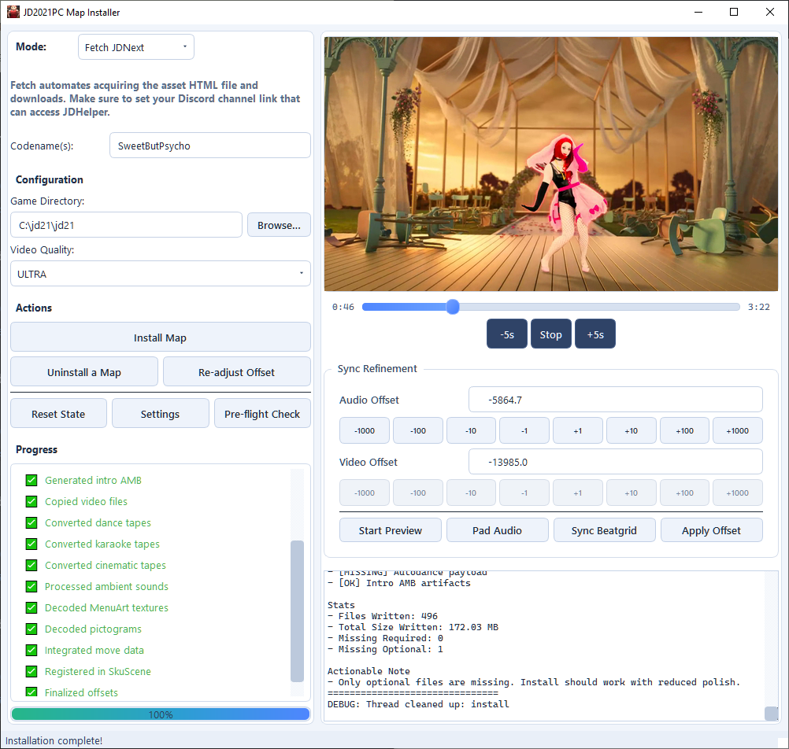

# JD2021 Map Installer v2


A Windows-first, pure Python GUI application built on **PyQt6** for extracting, building, and installing Just Dance maps into Just Dance 2021 PC. Supports multi-mode ingestion: codename fetch, HTML exports, IPK archives, batch installs, and manual source folders.

## Current Behavior Notes (Important)

- **Intro AMB is temporarily disabled** — the current pipeline intentionally forces silent intro placeholder behavior as a mitigation while AMB reliability is being redesigned.
- **IPK video offset remains approximate** — Xbox 360 binary CKDs do not reliably preserve lead-in timing. Manual sync tuning is expected for many IPK installs.
- **External tools are required for full fidelity** — FFmpeg/FFprobe and vgmstream availability directly affects media decode, conversion, and preview behavior.
- **JDNext support is still in active integration** — current JDNext extraction relies on third-party toolchain assets under `tools/`.

## Features

- **PyQt6 Dark-Themed GUI** — Modern split-panel interface with live log output, progress bar, and status bar. All heavy work runs on background `QThread` workers so the UI never freezes.
- **Headless Playwright Integration** — Replaces the legacy Node.js scraper. Uses `playwright-python` to fetch JDU asset pages via headless Chromium, or processes pre-saved HTML files.
- **QThread Concurrent Processing** — Extraction, normalization, and installation run in dedicated `QObject` workers that communicate with the main window exclusively through Qt signals (`progress`, `status`, `error`, `finished`).
- **Typed Data Pipeline** — The Extract → Normalize → Install pipeline produces a single canonical `NormalizedMapData` dataclass regardless of source format (web or IPK).
- **Multi-Mode Input Workflows** — Fetch by codename, HTML mode, IPK mode, batch directory mode, and manual source mode are supported in the same UI.
- **Pydantic Configuration** — All application settings (paths, quality tiers, timeouts, engine constants) are managed through a validated `AppConfig` model with environment variable support.
- **Full Binary CKD Parser** — Stateless parser for legacy binary (cooked) CKD files: musictracks, songdescs, choreography / karaoke tapes, cinematic tapes, autodance templates, and sound components.
- **IPK Archive Support** — Extracts maps from Xbox 360 `.ipk` archives with zlib / lzma decompression and path-traversal protection.
- **Video Quality Selection** — Choose from 8 quality tiers (Ultra HD down to Low) with automatic fallback.
- **Media Processing** — FFmpeg / FFprobe / Pillow wrappers for video transcoding, audio conversion, preview generation, and image format conversion.
- **Readjust & Batch Offset Tools** — Post-install sync refinement supports per-map and multi-map offset adjustment workflows.

## Module Overview

| Package | Purpose |
|---------|---------|
| `core/` | Data models (`NormalizedMapData`, tapes, clips), Pydantic `AppConfig`, and typed exception hierarchy |
| `extractors/` | `BaseExtractor` ABC, `WebPlaywrightExtractor` (HTML + live scraping), `ArchiveIPKExtractor` (IPK archives) |
| `parsers/` | `normalizer` (raw files → `NormalizedMapData`), `binary_ckd` (stateless binary CKD parser) |
| `installers/` | `game_writer` (UbiArt `.trk/.tpl/.act/.isc` generation), `media_processor` (FFmpeg / FFprobe / Pillow / vgmstream-dependent paths) |
| `ui/` | `MainWindow` (PyQt6), `workers/pipeline_workers.py` (QThread-based workers) |

## Quick Start

See **[Getting Started](docs/01_getting_started/GETTING_STARTED.md)** for the full setup walkthrough and how to start without these batch scripts.

```bash
# 1. First-time setup (installs Python deps and tool prerequisites)
setup.bat

# 2. Run the installer app
RUN.bat

```

## Documentation

- **[Documentation Index](docs/README.md)** - Central navigation for all docs

### Setup and Usage

- **[Getting Started](docs/01_getting_started/GETTING_STARTED.md)** — Dependencies, setup, and running the installer
- **[Usage Guide](docs/01_getting_started/USAGE_GUIDE.md)** — One-page beginner guide to setup, GUI options, settings, and modes
- **[Modes Guide](docs/01_getting_started/MODES_GUIDE.md)** — Complete mode-by-mode instructions (Fetch, HTML, IPK, Batch, Manual)
- **[GUI Reference](docs/01_getting_started/GUI_REFERENCE.md)** — PyQt6 main window layout, controls, and thread lifecycle
- **[Asset HTML Files](docs/03_media/ASSETS.md)** — Format and contents of `assets.html` and `nohud.html`
- **[Video Reference](docs/03_media/VIDEO.md)** — Quality tiers, fallback behavior, and persistence
- **[Troubleshooting](docs/01_getting_started/TROUBLESHOOTING.md)** — Common errors and solutions

### Architecture and Internals

- **[Architecture](docs/02_core/ARCHITECTURE.md)** — Component map, concurrency model, and data flow
- **[Pipeline Reference](docs/02_core/PIPELINE_REFERENCE.md)** — Extract → Normalize → Install phases and QThread orchestration
- **[Audio Timing & Pre-Roll Silence](docs/03_media/AUDIO_TIMING.md)** — The `videoStartTime` synchronization model
- **[Data Formats](docs/02_core/DATA_FORMATS.md)** — Binary and text file format reference (CKD, IPK, ISC, TRK, TPL, etc.)

### Data References

- **[Data Mapping](docs/02_core/DATA_MAPPING.md)** — Field-level mapping between JDU JSON payloads and JD2021 PC engine files
- **[Map Config Format](docs/04_reference/MAP_CONFIG_FORMAT.md)** — Per-map sync configuration JSON schema
- **[Game Config Reference](docs/04_reference/GAME_CONFIG_REFERENCE.md)** — JD2021 PC game configuration files
- **[Third-Party Tools](docs/04_reference/THIRD_PARTY_TOOLS.md)** — External dependencies and referenced projects

### Guides and Research

- **[Manual JDU Porting Guide](docs/05_guides/MANUAL_JDU_PORTING_GUIDE.md)** — How to manually port JDU-sourced maps
- **[Manual IPK Porting Guide](docs/05_guides/MANUAL_IPK_PORTING_GUIDE.md)** — How to manually port IPK-sourced maps
- **[Unused Data Opportunities](docs/06_research/JDU_UNUSED_DATA_OPPORTUNITIES.md)** — Catalog of JDU data fields not currently used
- **[Known Gaps](docs/06_research/KNOWN_GAPS.md)** — Remaining limitations and potential improvements

## Limitations

- **JD2021 PC only** — maps installed by this pipeline target the PC development build and are not compatible with console versions.
- **IPK video offset is approximate** — Xbox 360 binary CKDs store `videoStartTime = 0.0`. The pipeline synthesizes a reasonable default from musictrack markers, but manual adjustment may be required.
- **Intro AMB generation is intentionally disabled right now** — the current build forces silent intro placeholder behavior while AMB processing is under active reliability rework.
- **Some background AMB sounds remain silent** — mid-song AMB sounds hosted only on JDU servers cannot be downloaded in all cases.
- **JDHelper required for HTML modes** — asset Fetch/HTML mode files must be exported from the JDHelper Discord bot. Links expire quickly after the bot responds.
- **Toolchain completeness affects results** — missing FFmpeg/FFprobe or vgmstream can degrade decode/conversion paths, previews, and fallback behavior.
- **JDNext mapPackage extraction depends on local third-party tool staging** — if `AssetStudioModCLI.exe` is missing under `tools`, JDNext extraction may fail or fall back to reduced coverage.

## Credits

This project utilizes several essential third-party tools from the Just Dance modding community:

- **[JustDanceTools](https://github.com/WodsonKun/JustDanceTools)** — DeserializerSuite for binary CKD format reference, MediaTool for audio crop formula validation.
- **[XTX-Extractor](https://github.com/aboood40091/XTX-Extractor)** — For extracting textures from Switch-specific XTX containers.
- **[ubiart-archive-tools](https://github.com/PartyService/ubiart-archive-tools)** — IPK archive format reference.
- **JDTools by BLDS** — Tape processing logic analysis, vgmstream for XMA2 audio decoding.
- **[ferris_dancing](https://github.com/Kriskras99/ferris_dancing)** — Rust-based binary CKD parser used as a reference for field order validation.
- **[UBIART-AMB-CUTTER](https://github.com/RN-JK/UBIART-AMB-CUTTER)** — AMB extraction algorithm reference.
- **Just Dance Helper** — For providing JDU assets and NOHUD videos from Discord. Built by [rama0dev](https://github.com/rama0dev).
- **[AssetStudioMod](https://github.com/aelurum/AssetStudio)** / **AssetStudioModCLI** - JDNext bundle extraction and asset export tooling used to unpack mapPackage content during setup.
- **[Unity2UbiArt](https://github.com/Itaybl14/Unity2UbiArt)** - Source for the Unity-to-UbiArt conversion workflow used by the local JDNext toolchain staging area.
- **[UnityPy](https://github.com/K0lb3/UnityPy)** - Python-based Unity asset parsing reference used for JDNext bundle inspection and fallback extraction.

Special thanks to the authors and contributors of these tools for making Just Dance modding possible.
