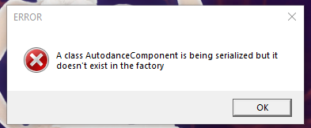
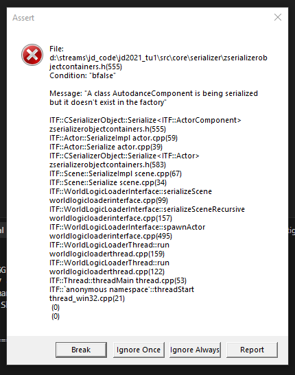

# JD2021 Map Builder & Installer

An automated pipeline for extracting, building, and installing custom JDU (Just Dance Unlimited) maps into Just Dance 2021 PC. 

This project goes beyond simple video parsing; it fully integrates original map logic, including controller tracking gestures and Autodance camera features, bridging the gap between basic video backdrops and fully playable, natively-scored levels.

## Features

- **Full Playable Extraction**: Downloads and parses `MAIN_SCENE_*.zip` assets dynamically based on provided HTML configuration files.
- **Multiformat Texture Support**: Automatically strips `.ckd` headers and converts internal texture formats (including compressed DDS layouts) into standard formats (PNG/TGA/JPG) for UI usage.
- **Gesture Tracking Support (Moves)**: Automatically identifies, extracts, and injects platform-specific controller scoring logic (`.msm` and `.msq`), converting them to `.gesture` formats compatible with NX (JoyCon), Durango/Scarlett (Kinect), and Wii/Orbis controllers. 
- **Autodance Generation**: Builds native Autodance camera logic (`.act` / `.isc` / `.tpl`) natively from cooked JSON templates so matches can output their video recaps correctly. Let's record those dances!
- **Audio Sync Tools**: Provides a built-in syncing loop with interactive FFplay preview to ensure custom audio correctly pads or matches your gameplay video offset.

## Repository Structure

The repository has been reorganized for clarity. Core automation scripts are in the root, while archives and advanced documentation are located in subdirectories:

- **Root**: Active automation pipeline scripts.
- **[docs/](docs/)**: Comprehensive technical specifications and guides.
- **[docs/archive/](docs/archive/)**: Outdated project discovery and handoff notes.
- **[scripts/archive/](scripts/archive/)**: Legacy map-specific build and test scripts.

## Core Scripts

* `map_downloader.py`: Scrapes and downloads all necessary IPKs, Zips, WebMs, and CKD assets from JDU server mapping files.
* `map_builder.py`: Autogenerates the massive UbiArt `.isc`, `.tpl`, and `.act` configurations for the map.
* `map_installer.py`: The main orchestrator. Handles unzipping, IPK unpacking, audio/video synchronization, asset conversion, and engine integration.
* `json_to_lua.py`: Converts UbiArt binary CKD files into readable JSON and then into engine-compatible `.lua` tapes.
* `ckd_decode.py`: Utility tool for decoding compressed CKD textures.

## Documentation

For advanced technical details, refer to the following guides:
- **[Manual Porting Guide](docs/MANUAL_PORTING_GUIDE.md)**: How to manually port a map without using the scripts.
- **[JDU Data Mapping Specification](docs/JDU_DATA_MAPPING.md)**: Technical breakdown of property mapping between JDU and JD2021 PC.

## Detailed Usage Guide

To use the automated installer, you need to provide two HTML files containing the JDU asset links and the NOHUD (No-HUD) video links. These are obtained using the **JDHelper** bot on Discord.

### Step 1: Query the Bot
1. Join a server that has the **JDHelper** bot (or add it to your own).
2. Use the bot's commands to query the **JDU assets** and **NOHUD assets** for the song you want to import. The links expire, so you need to do this right before running the script.

### Step 2: Extract the Data from Discord
1. Open Discord in your web browser (Chrome/Edge recommended).
2. Open **Developer Tools** (F12 or Ctrl+Shift+I).
3. Click the **Element Selector** icon in the top-left corner of the DevTools panel.
   
4. Hover over the JDHelper's response message in Discord. Aim for the area just above the main embed.
5. In the DOM tree, look for a `div` with an ID starting with `message-accessories-...`.

   
6. Once you see that its the correct element, click once.
7. On the elements panel, **Right-click** that `div` -> **Copy** -> **Copy element**.

### Step 3: Save and Run
1. Paste the copied code into a new text file. 
2. Save it as `assets.html` (for the JDU query) and `nohud.html` (for the NOHUD query).
3. Run the following command in your terminal:

```bash
python map_installer.py --map-name [MapName] --asset-html assets.html --nohud-html nohud.html
```

## Pre-requisites 
- A valid Just Dance 2021 PC development build.
- Python 3.x with dependencies.
- FFmpeg installed in your system PATH.
- `ubiart-archive-tools` located in the root directory.

## Credits

This project utilizes several essential third-party tools from the Just Dance modding community:

- **[JustDanceTools](https://github.com/the-m-v-p/JustDanceTools)**: For various UbiArt and Just Dance specific file manipulations.
- **[XTX-Extractor](https://github.com/Tofat/XTX-Extractor)**: For extracting textures from Switch-specific XTX containers.
- **[ubiart-archive-tools](https://github.com/the-m-v-p/ubiart-archive-tools)**: For unpacking and packing UbiArt `.ipk` archives.

Special thanks to the authors and contributors of these tools for making Just Dance modding possible.
