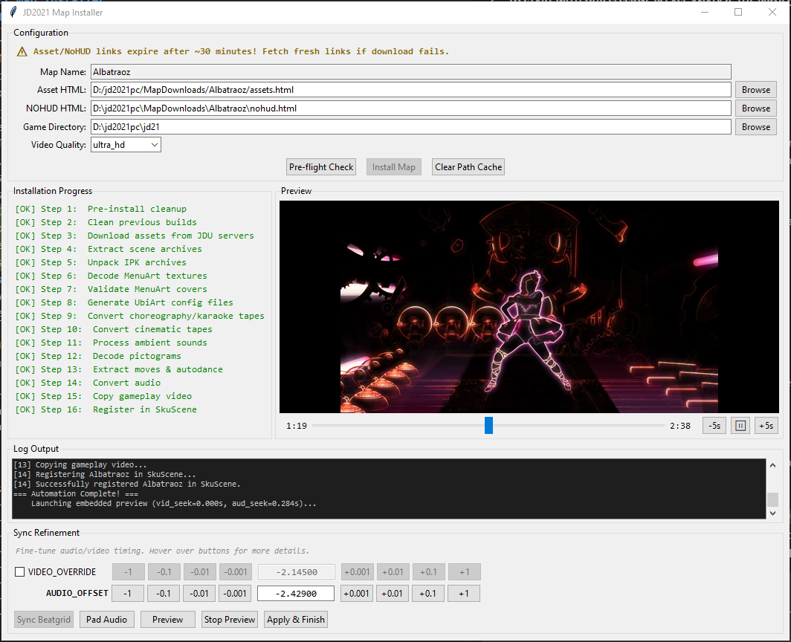

# JD2021 Map Installer

An automated pipeline for extracting, building, and installing JDU (Just Dance Unlimited) maps into Just Dance 2021 PC.

## Features

- **Full Playable Extraction**: Downloads and parses `MAIN_SCENE_*.zip` assets dynamically based on provided HTML configuration files.
- **GUI & CLI Installers**: Provides both a graphical interface (`gui_installer.py`) with live preview, sync refinement panel, and progress tracking, and a full CLI installer (`map_installer.py`) for scripted or headless use.
- **Automatic Map Name Detection**: Derives the map codename from JDU asset URLs automatically — no manual entry needed.
- **Video Quality Selection**: Choose from 8 quality tiers (Ultra HD down to Low) in both GUI and CLI. The installer handles link expiration and quality re-selection gracefully.
- **Map Config Persistence**: Saves sync refinement settings (video override, audio offset, quality) per map. On reinstall, previously saved configs are automatically reloaded.
- **Multiformat Texture Support**: Automatically strips `.ckd` headers and converts internal texture formats (including compressed DDS and Nintendo Switch XTX) into standard formats (PNG/TGA/JPG) for UI usage.
- **UbiArt-Aware Tape Conversion**: Converts choreography, karaoke, and cinematic tapes from JDU JSON to engine-compatible Lua with proper MotionClip color hex encoding, platform-specific motion data (KEY/VAL), `Tracks` array generation, and cinematic curve processing (`vector2dNew`) with actor path resolution.
- **Cinematic & Ambient Sound Support**: Processes cinematic tapes with curve data and ambient sound templates into engine-ready `.ilu`/`.tpl` pairs.
- **Pre-Roll Audio Coverage**: Generates an intro AMB that covers the silence window caused by negative `videoStartTime` (the engine's WAV scheduling delay). Sources audio from the same OGG as the main track, making the overlap inaudible. Formula scales automatically to any map.
- **Full DefaultColors Extraction**: Extracts all song theme colors (`lyrics`, `theme`, `songColor_1A/1B/2A/2B`, and any extras) from JDU metadata with case-insensitive key matching and hex conversion.
- **Cross-Platform Gesture Merging**: Automatically merges gesture files (`.gesture`, `.msm`) from all platform folders into PC/. Only copies Kinect-compatible `.gesture` files (from DURANGO/SCARLETT) and substitutes ORBIS-exclusive variants with the nearest Kinect equivalent to avoid format mismatches.
- **Autodance Generation**: Converts cooked autodance data (CKD) into native Autodance camera logic (`.act` / `.isc` / `.tpl`) with full recording/video structures and FX parameters. Protected against accidental overwrite during sync refinement.
- **Audio Sync Tools**: Provides a built-in syncing loop with interactive FFplay preview to ensure custom audio correctly pads or matches your gameplay video offset. Intro AMB regenerates automatically on every sync adjustment.

## Core Scripts

- `gui_installer.py`: Graphical interface for the installer. Provides file browsing, auto-detected map name, video quality selection, real-time progress, sync refinement with FFplay preview, and map config persistence.
- `map_installer.py`: The main orchestrator. Handles downloading, unzipping, IPK unpacking, tape conversion, audio/video synchronization, intro AMB generation, asset conversion, and engine integration. Can be used standalone via CLI.
- `map_builder.py`: Autogenerates the UbiArt `.isc`, `.tpl`, `.act`, `.trk`, and `.mpd` configurations for the map, including enriched SongDesc metadata and full DefaultColors extraction from CKD data.
- `map_downloader.py`: Scrapes and downloads all necessary IPKs, ZIPs, WebMs, and CKD assets from JDU server mapping HTML files.
- `ubiart_lua.py`: UbiArt-aware Lua converter for tapes and game data. Handles MotionClip color encoding, MotionPlatformSpecifics KEY/VAL conversion, cinematic curve processing with `vector2dNew()`, ActorIndices-to-ActorPaths resolution, `Tracks` array generation, and ambient sound template processing.
- `json_to_lua.py`: Generic JSON-to-Lua converter used for non-tape files (autodance templates, stape data). For tape conversion, see `ubiart_lua.py`.
- `ckd_decode.py`: Decodes compressed CKD textures (strips 44-byte UbiArt header, handles DDS and XTX/Nintendo Switch formats).
- `batch_install_maps.py`: Two-phase batch installer. Downloads all maps first (while CDN links are fresh), then processes them locally. Supports `--skip-existing`, `--only`, and `--exclude` filters.

## Documentation

### Setup and Usage

- **[Getting Started](docs/GETTING_STARTED.md)** — Full setup walkthrough: dependencies, third-party tools, obtaining JD2021 PC, and running the installer.
- **[GUI Reference](docs/GUI_REFERENCE.md)** — GUI controls, sync refinement panel, embedded preview, and post-install cleanup.
- **[CLI Reference](docs/CLI_REFERENCE.md)** — CLI arguments, interactive sync loop, batch mode, and preflight checks.
- **[Asset HTML Files](docs/ASSETS.md)** — Format and contents of `assets.html` and `nohud.html`, CDN URL anatomy, and what the pipeline downloads from each.
- **[Video Reference](docs/VIDEO.md)** — Quality tiers, fallback behavior, persistence, and NOHUD file analysis.
- **[Troubleshooting](docs/TROUBLESHOOTING.md)** — Common errors and solutions derived from code analysis.

### Architecture and Internals

- **[Architecture](docs/ARCHITECTURE.md)** — Internal component map, PipelineState, data flow, dual interface pattern, and design decisions.
- **[Pipeline Reference](docs/PIPELINE_REFERENCE.md)** — Every pipeline step: inputs, outputs, failure modes, and skip conditions.
- **[Audio Timing & Pre-Roll Silence](docs/AUDIO_TIMING.md)** — The `videoStartTime` synchronization model and the AMB intro solution.
- **[Data Formats](docs/DATA_FORMATS.md)** — Binary and text file format reference (CKD, IPK, ISC, TRK, TPL, etc.).

### Data References

- **[JDU Data Mapping](docs/JDU_DATA_MAPPING.md)** — Field-level mapping between JDU JSON payloads and JD2021 PC engine files.
- **[Map Config Format](docs/MAP_CONFIG_FORMAT.md)** — Per-map sync configuration JSON schema.
- **[Game Config Reference](docs/GAME_CONFIG_REFERENCE.md)** — JD2021 PC game configuration files and modding-relevant settings.
- **[Third-Party Tools](docs/THIRD_PARTY_TOOLS.md)** — External dependencies, bundled tools, and referenced projects.

### Guides and Research

- **[Manual Porting Guide](docs/MANUAL_PORTING_GUIDE.md)** — How to manually port a map without using the scripts; full map directory structure.
- **[Unused Data Opportunities](docs/JDU_UNUSED_DATA_OPPORTUNITIES.md)** — Catalog of JDU data fields not currently used.
- **[Known Gaps](docs/KNOWN_GAPS.md)** — Remaining limitations and potential improvements.
- **[Mobile Scoring Restoration](docs/MOBILE_SCORING_RESTORATION.md)** — Binary patching research for phone controller scoring.

## Limitations

- **JD2021 PC only** — maps installed by this pipeline target the PC development build and are not compatible with console versions.
- **Some background AMB sounds remain silent** — AMB sounds that play mid-song (SoundSetClips with `StartTime > 0`) are kept as silent placeholders; their audio is hosted on JDU servers and cannot be downloaded. AMBs that play during the intro (SoundSetClips with `StartTime <= 0`) are automatically populated with real audio from the OGG pre-roll.
- **JDHelper required** — asset HTML files must be exported from the JDHelper Discord bot. Links expire quickly after the bot responds.
- **WAV scheduling jitter (fallback maps only)** — when musictrack marker data is available, intro AMB duration is derived precisely from the audio data. When marker data is absent, a heuristic tail of 1.355s is used; on systems with unusually high audio pipeline latency this gap may still be audible, though this has not been observed in practice.
- **No multi-audio-track support** — maps with more than one audio stream are not supported.

## Credits

This project utilizes several essential third-party tools from the Just Dance modding community:

- **[JustDanceTools](https://github.com/WodsonKun/JustDanceTools)**: For various UbiArt and Just Dance specific file manipulations.
- **[XTX-Extractor](https://github.com/aboood40091/XTX-Extractor)**: For extracting textures from Switch-specific XTX containers.
- **[ubiart-archive-tools](https://github.com/PartyService/ubiart-archive-tools)**: For unpacking and packing UbiArt `.ipk` archives.
- **JDTools by BLDS**: Tape processing logic was analyzed and ported, bringing cinematic curve handling, MotionClip color conversion, ambient sound processing, and improved Lua serialization to this pipeline.
- **[UBIART-AMB-CUTTER](https://github.com/RN-JK/UBIART-AMB-CUTTER)**: AMB extraction algorithm (marker tick-to-millisecond formula and SoundSetClip splitting logic) used as a reference for implementing the automated AMB audio generation in this pipeline.
- **Just Dance Helper**: For providing a way to get JDU assets and NOHUD videos from Discord. Built by [rama0dev](https://github.com/rama0dev).

Special thanks to the authors and contributors of these tools for making Just Dance modding possible.
