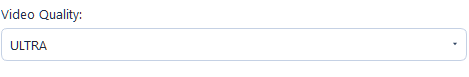
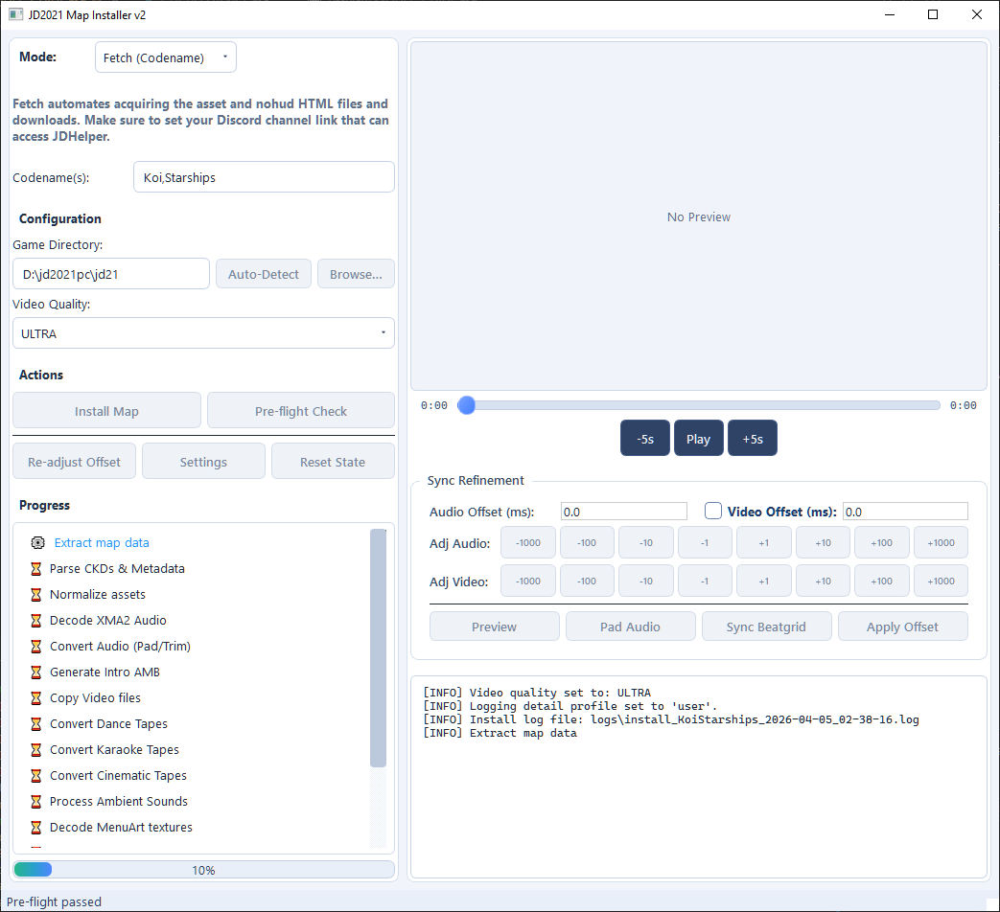

# Modes Guide

> **Last Updated:** April 2026 | **Applies to:** JD2021 Map Installer v2

This guide explains every installer mode in detail, including when to use each one, required inputs, setup checks, and mode-specific troubleshooting.

---

## Table of Contents

- [What "Mode" Means](#what-mode-means)
- [Mode Quick Comparison](#mode-quick-comparison)
- [Before You Use Any Mode](#before-you-use-any-mode)
- [Mode 1: Fetch (Codename)](#mode-1-fetch-codename)
   - [When to use it](#when-to-use-it)
   - [What you need](#what-you-need)
   - [Find codenames and compatible maps](#find-codenames-and-compatible-maps)
   - [Quick steps](#quick-steps)
   - [Quick troubleshooting](#quick-troubleshooting)
- [Mode 2: HTML File](#mode-2-html-file)
- [Mode 3: IPK Archive](#mode-3-ipk-archive)
- [Mode 4: Batch (Directory)](#mode-4-batch-directory)
- [Mode 5: Manual (Directory)](#mode-5-manual-directory)
- [Choosing the Right Mode](#choosing-the-right-mode)
- [After Install: Sync Refinement](#after-install-sync-refinement)
- [Mode-Specific Troubleshooting Checklist](#mode-specific-troubleshooting-checklist)
- [Related Docs](#related-docs)

---

## What "Mode" Means

A mode is the source workflow used to provide map data to the pipeline.

All modes eventually go through the same backend phases:

1. Extract source files/data
2. Normalize into a canonical map model
3. Install generated files into JD2021 PC
4. Optionally readjust sync offsets after install

The difference between modes is only how source data is collected and validated.

---

## Mode Quick Comparison

| Mode | Best For | Input Type | Internet Needed | Typical Complexity |
|------|----------|------------|-----------------|--------------------|
| Fetch (Codename) | Fast installs when you know the codename | One or more codenames | Yes | Low |
| HTML File | Stable/repeatable installs from saved exports | `assets.html` + `nohud.html` | No (if files already saved) | Low-Medium |
| IPK Archive | Xbox 360 map archives | `.ipk` file | No | Medium |
| Batch (Directory) | Installing many maps in one run | Folder with map candidates | Depends on source files | Medium |
| Manual (Directory) | Advanced/custom map source layouts | Folder you organize manually | No | High |

---

## Before You Use Any Mode

Do these once before first install:

1. Run `setup.bat` from project root.
2. Launch with `RUN.bat`.
3. In app Configuration, set your JD2021 game `data` folder.
4. Confirm external tools resolve:
   - `ffmpeg`
   - `ffprobe`
   - `vgmstream-cli` (important for some decode paths)
5. For Fetch mode only, confirm Playwright Chromium is installed.

If you are testing JDNext mapPackage flows, also confirm:

1. `tools/AssetStudio` exists.
2. `tools/UnityPy` exists.
3. `tools/Unity2UbiArt/bin/AssetStudioModCLI/AssetStudioModCLI.exe` exists.

Recommended safety checks before every install:

1. Run **Pre-flight Check**.
2. Verify mode input fields are filled and point to expected files.
3. Read warnings in the log panel before pressing Install.

---

## Mode 1: Fetch (Codename)

### When to use it

Use Fetch when you have the map codename and want the installer to get everything automatically.

Use HTML mode instead only if Fetch fails or if you already saved `assets.html` + `nohud.html`.

### What you need

1. One or more codenames (comma-separated).
2. Internet connection.
3. Playwright Chromium installed (`python -m playwright install chromium`).
4. A valid `discord_channel_url` in Settings for your setup.

### Find codenames and compatible maps

1. Codename reference: <https://justdance.fandom.com>
2. JDU list (good Fetch compatibility reference):
   <https://justdance.fandom.com/wiki/Just_Dance_Unlimited>

### Quick steps

1. Open Mode Selector and choose **Fetch (Codename)**.
   
2. Enter codename(s), example: `TemperatureAlt` or `TemperatureAlt, Koi`.
   
3. Pick video quality.
   
4. Run **Pre-flight Check**.
   
5. Click **Install Map**.
   
6. Wait for completion, then test in game.
   
7. If sync is off, use **Re-adjust Offset**.
   

### Quick troubleshooting

1. `Chromium not installed`:
   Run `python -m playwright install chromium`.
2. Timeout or no response:
   Retry with one codename first.
3. Codename fails repeatedly:
   Check codename spelling/casing, then try HTML mode fallback.
4. Map installs but timing is off:
   Use **Re-adjust Offset**.

---

## Mode 2: HTML File

### When to use it

Use HTML mode when you already exported/saved JDU bot pages and want a reproducible offline install path.

### You need

1. Asset HTML file (commonly `assets.html`).
2. NOHUD HTML file (commonly `nohud.html`).
3. Matching pair from the same song/version.

### Steps

1. Select **HTML File** mode.
2. Pick the asset HTML file.
3. Pick the NOHUD HTML file.
4. Run **Pre-flight Check**.
5. Click **Install Map**.
6. Review logs for pairing/parse warnings.
7. Use Sync Refinement if needed after install.

### Good practices

1. Store each map's HTML pair in its own folder.
2. Keep original filenames when possible.
3. Do not mix files from different export sessions.

### Common issues

1. Expired or malformed HTML export:
   Re-export from source bot and retry.
2. Pair mismatch (`assets` and `nohud` do not belong together):
   Re-select correct matching files.
3. Missing media references:
   Re-fetch files or switch to Fetch mode.

---

## Mode 3: IPK Archive

### When to use it

Use IPK mode for local Xbox 360 `.ipk` map archives.

### You need

1. A valid `.ipk` file.
2. Enough temp disk space for extraction and conversion.

### Steps

1. Select **IPK Archive** mode.
2. Choose your `.ipk` file.
3. Run **Pre-flight Check**.
4. Click **Install Map**.
5. Wait for archive extraction and conversion stages.
6. Test map in game.
7. Use Sync Refinement to tune timing if needed.

### Important timing note

IPK-derived timing can be approximate. Video lead-in often needs manual refinement after install. This is expected behavior for many IPK sources.

### Common issues

1. Invalid/corrupt IPK:
   Re-obtain file and verify size/hash if possible.
2. Missing decode tools:
   Confirm `ffmpeg`, `ffprobe`, and `vgmstream-cli` availability.
3. Video starts too early/late:
   Apply offset adjustments in Sync Refinement.

---

## Mode 4: Batch (Directory)

### When to use it

Use Batch mode when you want to process many install candidates from a single root folder.

### You need

1. A root directory that contains map candidates (files/folders supported by your selected workflow).
2. Consistent naming/layout to reduce skipped entries.

### Steps

1. Select **Batch (Directory)** mode.
2. Choose the root folder containing maps.
3. Confirm batch source content is what you expect.
4. Run **Pre-flight Check**.
5. Start install.
6. Monitor logs for per-item success/failure.
7. Re-run failed entries individually (recommended) using the most suitable mode.

### Good practices

1. Dry-run with a small subset first.
2. Keep one map per subfolder where possible.
3. Review log output for skipped candidates before rerunning.

### Common issues

1. Mixed or ambiguous folder structure:
   Reorganize into clearer per-map subfolders.
2. Wrong file type assumptions in source folder:
   Separate IPK files from HTML exports and manual roots.
3. Partial batch success:
   Retry failures one-by-one to isolate mode/input problems.

---

## Mode 5: Manual (Directory)

### When to use it

Use Manual mode for advanced cases where you provide source files directly from your own prepared directory layout.

### You need

1. A manually prepared source folder.
2. Understanding of expected map asset structure.
3. Willingness to troubleshoot missing/inconsistent inputs.

### Steps

1. Select **Manual (Directory)** mode.
2. Choose your prepared source folder.
3. Run **Pre-flight Check**.
4. Click **Install Map**.
5. Inspect logs closely for missing components.
6. Adjust source files and retry until normalization succeeds.

### Good practices

1. Start from a known-good map structure and modify gradually.
2. Keep backup copies of your manual source sets.
3. Validate one map fully before scaling to many maps.

### Common issues

1. Missing required assets:
   Check folder structure and expected media/config files.
2. Unsupported naming/casing mismatches:
   Normalize filenames and folder casing.
3. Install succeeds but playback quality is wrong:
   Verify source media fidelity and toolchain availability.

---

## Choosing the Right Mode

Use this decision flow:

1. Have codename and working online fetch setup?
   Use **Fetch**.
2. Already have `assets.html` + `nohud.html` pair?
   Use **HTML**.
3. Have `.ipk` archives?
   Use **IPK**.
4. Need to process many maps from one folder?
   Use **Batch**.
5. Need custom/advanced source control?
   Use **Manual**.

---

## After Install: Sync Refinement

No matter which mode you used, if timing looks off:

1. Open Sync Refinement.
2. Preview playback.
3. Adjust audio offset (and video offset if exposed for your workflow).
4. Apply and retest.
5. Save per-map adjustments for future runs if supported.

---

## Mode-Specific Troubleshooting Checklist

If an install fails, check in this order:

1. Correct mode selected for your source type.
2. Input paths point to the exact expected files/folder.
3. Game directory is set to JD2021 `data` folder.
4. Pre-flight check passes.
5. Required tools are available (`ffmpeg`, `ffprobe`, `vgmstream-cli`, and Chromium for Fetch).
6. Source files are complete and from the same map/version.
7. Retry one map at a time to isolate root cause.

---

## Related Docs

- [Getting Started](GETTING_STARTED.md)
- [GUI Reference](GUI_REFERENCE.md)
- [Troubleshooting](TROUBLESHOOTING.md)
- [Audio Timing](../03_media/AUDIO_TIMING.md)
- [Pipeline Reference](../02_core/PIPELINE_REFERENCE.md)