# Modes Guide

> **Last Updated:** April 2026 | **Applies to:** JD2021 Map Installer v2

This guide explains every installer mode in detail, including when to use each one, required inputs, setup checks, and mode-specific troubleshooting.

---

## Table of Contents

- [What "Mode" Means](#what-mode-means)
- [Mode Quick Comparison](#mode-quick-comparison)
- [Before You Use Any Mode](#before-you-use-any-mode)
- [Mode 1: Fetch (Codename)](#mode-1-fetch-codename)
   - [When to use it](#when-to-use-it)
   - [What you need](#what-you-need)
   - [Find codenames and compatible maps](#find-codenames-and-compatible-maps)
   - [Quick steps](#quick-steps)
   - [Quick troubleshooting](#quick-troubleshooting)
- [Mode 2: HTML File](#mode-2-html-file)
   - [When to use it](#when-to-use-it-1)
   - [What you need](#what-you-need-1)
   - [Quick steps](#quick-steps-1)
   - [Quick troubleshooting](#quick-troubleshooting-1)
- [Mode 3: IPK Archive](#mode-3-ipk-archive)
   - [When to use it](#when-to-use-it-2)
   - [What you need](#what-you-need-2)
   - [Quick steps](#quick-steps-2)
   - [Quick troubleshooting](#quick-troubleshooting-2)
- [Mode 4: Batch (Directory)](#mode-4-batch-directory)
   - [When to use it](#when-to-use-it-3)
   - [What you need](#what-you-need-3)
   - [Quick steps](#quick-steps-3)
   - [Quick troubleshooting](#quick-troubleshooting-3)
- [Mode 5: Manual (Directory)](#mode-5-manual-directory)
   - [When to use it](#when-to-use-it-4)
   - [What you need](#what-you-need-4)
   - [Quick steps](#quick-steps-4)
   - [Quick troubleshooting](#quick-troubleshooting-4)
- [Choosing the Right Mode](#choosing-the-right-mode)
- [After Install: Sync Refinement](#after-install-sync-refinement)
- [Mode-Specific Troubleshooting Checklist](#mode-specific-troubleshooting-checklist)
- [Related Docs](#related-docs)

---

## What "Mode" Means

A mode is the source workflow used to provide map data to the pipeline.

All modes eventually go through the same backend phases:

1. Extract source files/data
2. Normalize into a canonical map model
3. Install generated files into JD2021 PC
4. Optionally readjust sync offsets after install

The difference between modes is only how source data is collected and validated.

---

## Mode Quick Comparison

| Mode | Best For | Input Type | Internet Needed | Typical Complexity |
|------|----------|------------|-----------------|--------------------|
| Fetch (Codename) | Fast installs when you know the codename | One or more codenames | Yes | Low |
| HTML File | Stable/repeatable installs from saved exports | `assets.html` + `nohud.html` | No (if files already saved) | Low-Medium |
| IPK Archive | Xbox 360 map archives | `.ipk` file | No | Medium |
| Batch (Directory) | Installing many maps in one run | Folder with map candidates | Depends on source files | Medium |
| Manual (Directory) | Advanced/custom map source layouts | Folder you organize manually | No | High |

---

## Before You Use Any Mode

Do these once before first install:

1. Run `setup.bat` from project root.
2. Launch with `RUN.bat`.
3. In app Configuration, set your JD2021 game `data` folder.
4. Confirm external tools resolve:
   - `ffmpeg`
   - `ffprobe`
   - `vgmstream-cli` (important for some decode paths)
5. For Fetch mode only, confirm Playwright Chromium is installed.
6. Set up Game Directory, select the directory that containes the `data` folder and `engine` folder of your JD2021 PC installation.
   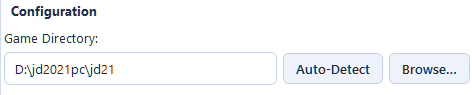

Recommended safety checks before every install:

1. Run **Pre-flight Check**.
2. Verify mode input fields are filled and point to expected files.
3. Read warnings in the log panel before pressing Install.

---

## Mode 1: Fetch (Codename)

### When to use it

Use Fetch when you have the map codename and want the installer to get everything automatically.

Use HTML mode instead only if Fetch fails or if you already saved `assets.html` + `nohud.html`.

### What you need

1. One or more codenames (comma-separated).
2. Internet connection.
3. Playwright Chromium installed (`python -m playwright install chromium`). Should already be installed when you ran `setup.bat`.
4. A valid `discord_channel_url` in Settings for your setup.

### Find codenames and compatible maps

1. Codename reference: <https://justdance.fandom.com>
2. JDU list (good Fetch compatibility reference):
   <https://justdance.fandom.com/wiki/Just_Dance_Unlimited>

### Quick steps

1. Open Mode Selector and choose **Fetch (Codename)**.
   
   
2. Enter codename(s), example: `TemperatureAlt`, `TemperatureAlt` or `Koi`.
   
   
3. Pick video quality.
   
   
4. Run **Pre-flight Check**.
   
   
5. Click **Install Map**.
   
   
6. For first time run, you must login to a discord account when the Playwright browser opens. Follow the on-screen instructions to complete login and the installer will continue with fetching.
   
   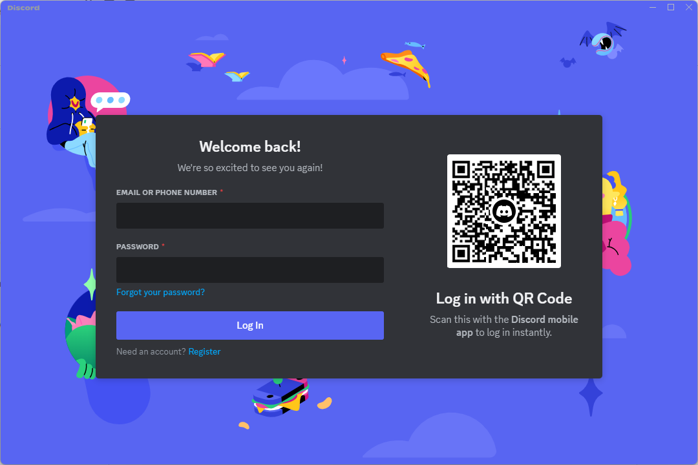
7. after completion, verify the offset by checking the preview feature. And then click Apply to finalize the installation and verify in game.
   
   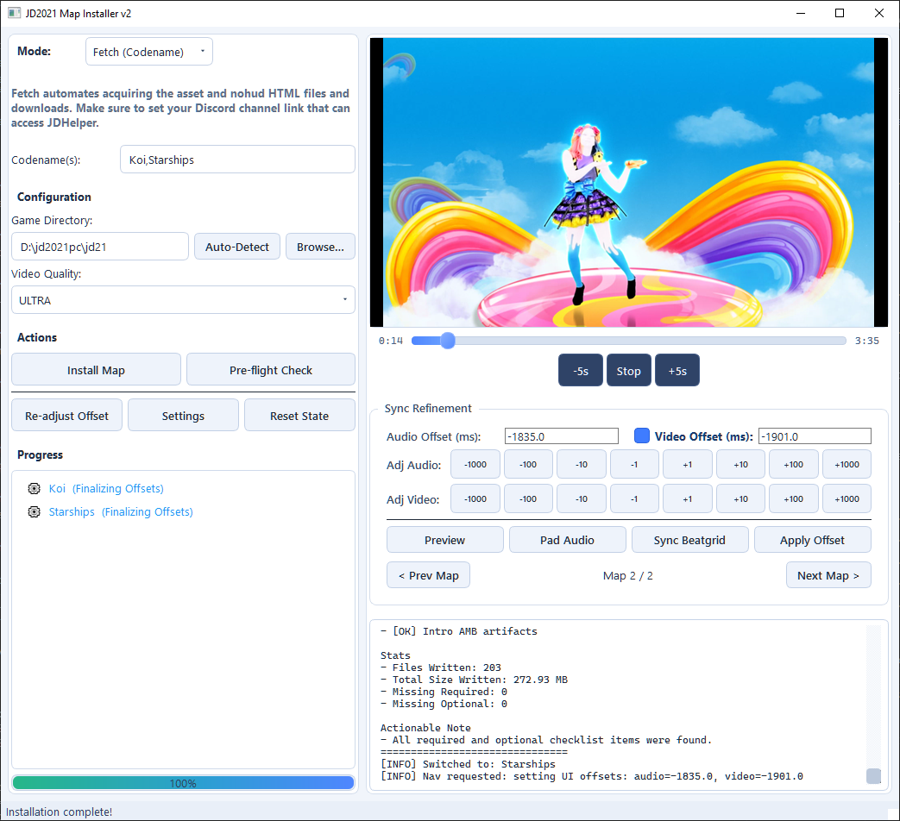
8. If sync is off, use **Re-adjust Offset**.
   
   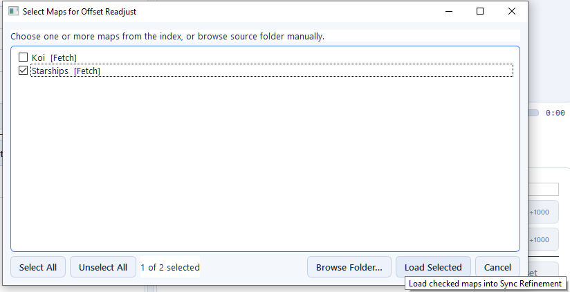

### Quick troubleshooting

1. `Chromium not installed`:
   Run `python -m playwright install chromium`.
2. Timeout or no response:
   Retry with one codename first.
3. Codename fails repeatedly:
   Check codename spelling/casing, then try HTML mode fallback.
4. Map installs but timing is off:
   Use **Re-adjust Offset**.

---

## Mode 2: HTML File

### When to use it

Use HTML mode when you already have saved HTML exports and want a stable, repeatable install.

If the HTML files are fresh, it will download the necessary files. This is why it needs to be ran through the tool first to download files. After the first run, it can be used offline as long as the same HTML files are used again.

It is also a good fallback if Fetch mode cannot complete for a map.

### What you need

1. One asset HTML file (usually `assets.html`).
2. One NOHUD HTML file (usually `nohud.html`).
3. Both files must come from the same song/version.

### Quick steps

1. Open Mode Selector and choose **HTML File**.

   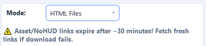
2. Choose your asset HTML file.

   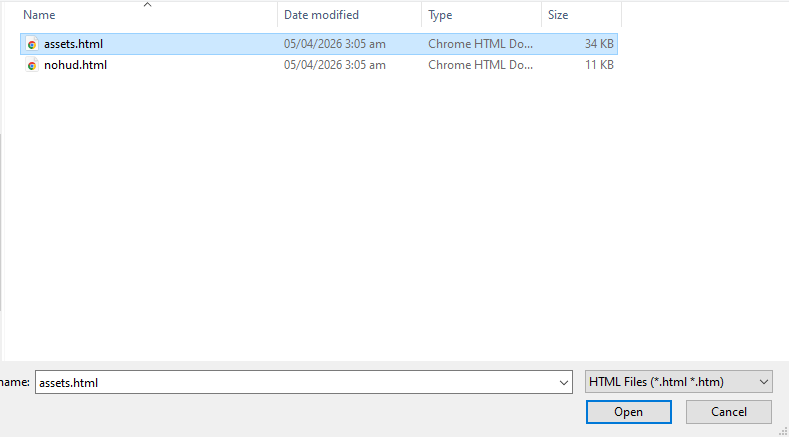
3. Choose your NOHUD HTML file.

   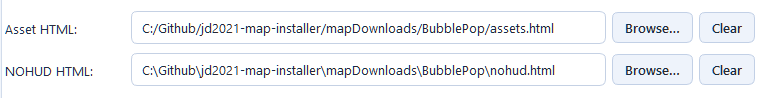
4. Run **Pre-flight Check**.

   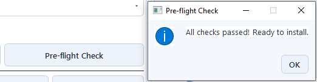
5. Click **Install Map** and wait for completion.

   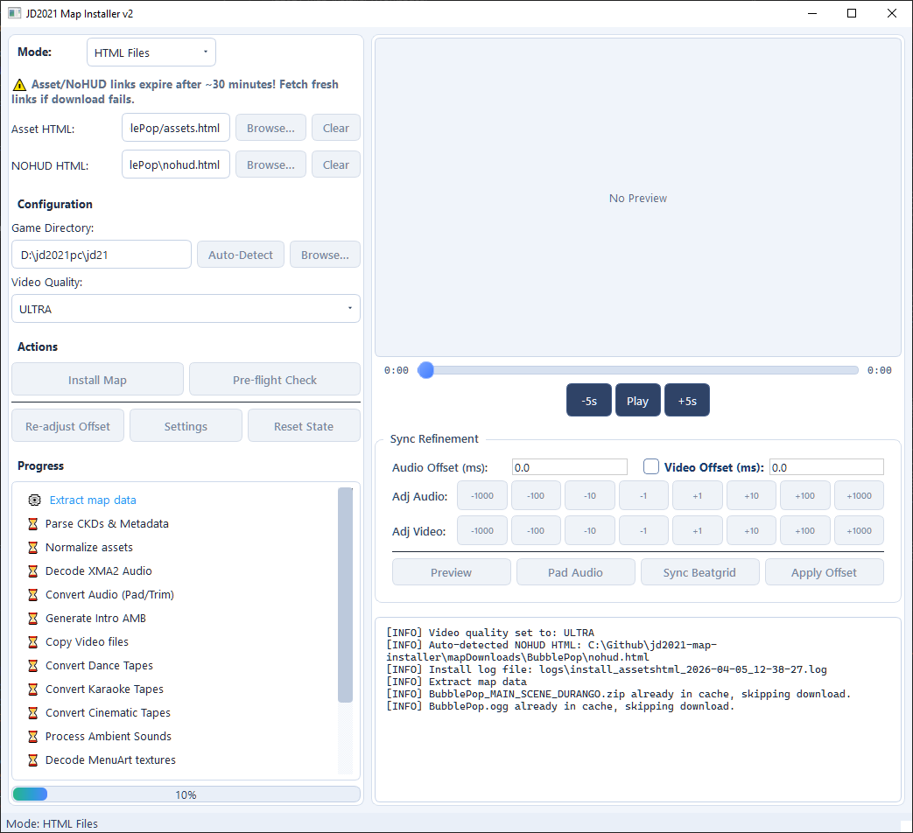
6. Test in game, then use **Re-adjust Offset** only if timing is off.

   

### Quick troubleshooting

1. Install fails with pairing or parse warnings:
   Re-select both HTML files and confirm they are a matching pair.
2. HTML looks old or broken:
   Re-export fresh files and try again.
3. Missing media or incomplete install:
   Re-fetch the map files or switch to Fetch mode.
4. Map installs but timing is off:
   Use **Re-adjust Offset** after install.

---

## Mode 3: IPK Archive

### When to use it

Use IPK mode when your source is a local Xbox 360 `.ipk` file.

IPK works for both:
1. Single-map archives (one map in the file).
   `codename.ipk`
2. Bundle archives (multiple maps in one file).
   `bundle_x.ipk`

### What you need

1. A valid `.ipk` file.
2. Enough temp disk space for extraction and conversion.
3. Working media tools (`ffmpeg`, `ffprobe`, `vgmstream-cli`).

### Where to get IPK files

1. Both Single and Bundles can be found within Just Dance Xbox 360 Mods. They either contain individual maps (ie. `canttameher.ipk`, `sweetbutpsycho.ipk`) or bundles of maps (ie. `bundle_1._x360.ipk`).

### Quick steps

1. Select **IPK Archive** mode.
   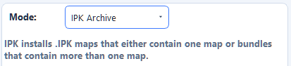
2. Choose your `.ipk` file.
   
3. If it is a **single-map IPK**: run **Pre-flight Check**, then click **Install Map**.
   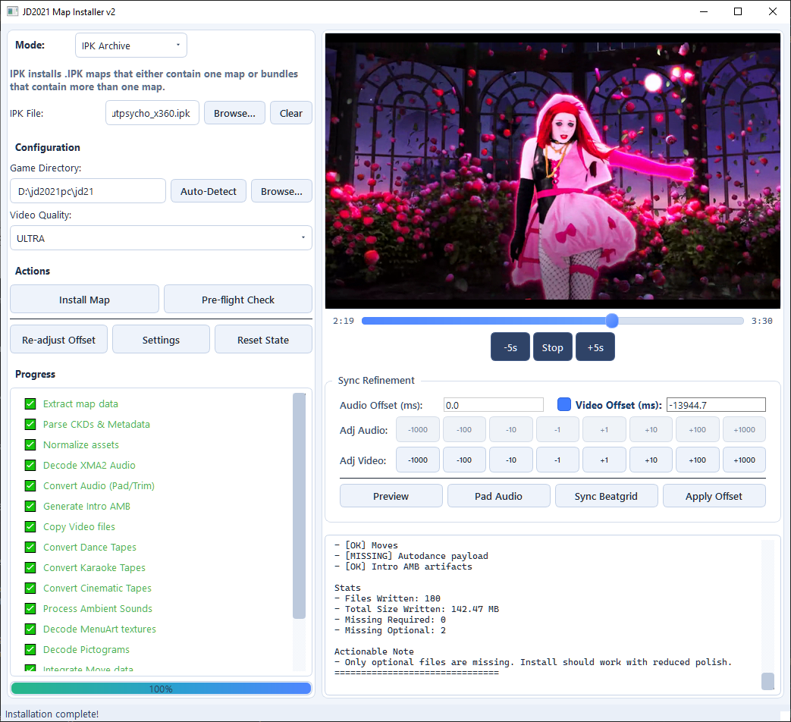
4. If it is a **bundle IPK**: when the bundle selection dialog appears, check the map(s) you want, then continue install.
   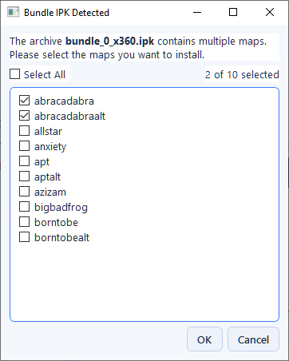
5. Wait for extraction and conversion to complete, then test in game.
   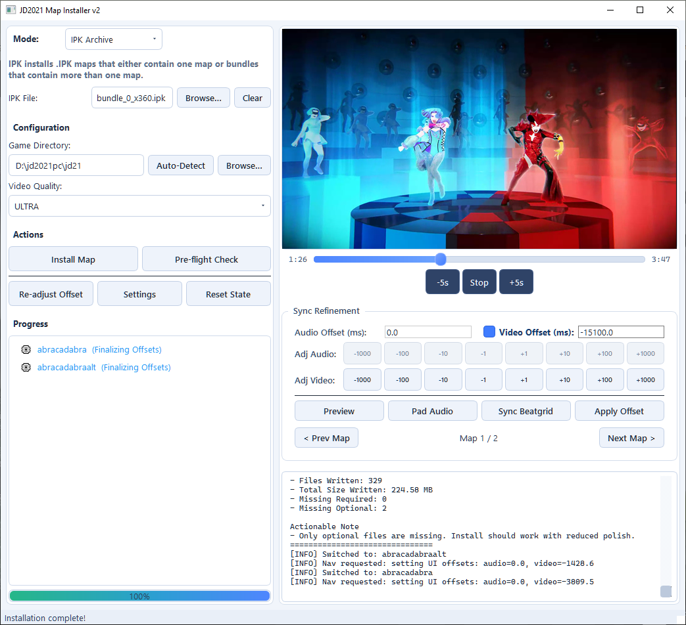
6. If timing is off, open **Re-adjust Offset** and tune video sync.
   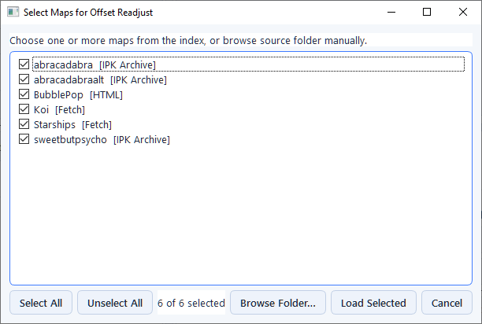

### Quick troubleshooting

1. Invalid/corrupt IPK:
   Re-obtain the file and try again.
2. Missing decode tools:
   Run setup again and confirm `ffmpeg`, `ffprobe`, and `vgmstream-cli` are available.
3. Bundle dialog appears but nothing installs:
   Re-open install and make sure at least one map is checked in the bundle dialog.
4. Video starts too early/late:
   This is common for IPK sources; use **Re-adjust Offset** after install.

---

## Mode 4: Batch (Directory)

### When to use it

Use Batch mode when you want to process many install candidates from a single root folder.

### What you need

1. One root folder that contains install candidates.
2. Candidate types must be either:
   - IPK files (`.ipk`), or
   - map folders that contain both `assets.html` and `nohud.html`.
3. A stable internet connection if your HTML links are still being fetched during the run.

### Quick steps

1. Select **Batch (Directory)** mode.
   
2. Choose the root folder containing maps.
   
3. Confirm the folder contains valid candidates before starting.
   
4. Run **Pre-flight Check**.
   
5. Start install.
   
6. Monitor logs for per-item success/failure.
   
7. Re-run failed entries one-by-one using the most suitable mode.
   

### Quick troubleshooting

1. `No valid map folders found`:
   Check that each candidate is either an `.ipk` file or a folder with both `assets.html` and `nohud.html`.
2. Many maps fail with `403` or expired links:
   Reduce batch size and retry with fresher HTML links.
3. Some maps succeed and others fail:
   Open logs, then retry failed maps individually to isolate bad inputs.

---

## Mode 5: Manual (Directory)

### When to use it

Use Manual mode for advanced cases where you provide source files directly from your own prepared directory layout.

### What you need

1. A manually prepared source folder.
2. Understanding of expected map asset structure.
3. Willingness to troubleshoot missing/inconsistent inputs.

### Quick steps

1. Select **Manual (Directory)** mode.
   
2. Choose your prepared source folder.
   
3. Run **Pre-flight Check**.
   
4. Click **Install Map**.
   
5. Inspect logs closely for missing components.
   
6. Adjust source files and retry until normalization succeeds.
   

### Quick troubleshooting

1. Missing required assets:
   Check folder structure and expected media/config files.
2. Unsupported naming/casing mismatches:
   Normalize filenames and folder casing.
3. Install succeeds but playback quality is wrong:
   Verify source media fidelity and toolchain availability.

---

## Choosing the Right Mode

Use this decision flow:

1. Have codename and working online fetch setup?
   Use **Fetch**.
2. Already have `assets.html` + `nohud.html` pair?
   Use **HTML**.
3. Have `.ipk` archives?
   Use **IPK**.
4. Need to process many maps from one folder?
   Use **Batch**.
5. Need custom/advanced source control?
   Use **Manual**.

---

## After Install: Sync Refinement

No matter which mode you used, if timing looks off:

1. Open Sync Refinement.
2. Preview playback.
3. Adjust audio offset (and video offset if exposed for your workflow).
4. Apply and retest.
5. Save per-map adjustments for future runs if supported.

---

## Mode-Specific Troubleshooting Checklist

If an install fails, check in this order:

1. Correct mode selected for your source type.
2. Input paths point to the exact expected files/folder.
3. Game directory is set to JD2021 `data` folder.
4. Pre-flight check passes.
5. Required tools are available (`ffmpeg`, `ffprobe`, `vgmstream-cli`, and Chromium for Fetch).
6. Source files are complete and from the same map/version.
7. Retry one map at a time to isolate root cause.

---

## Related Docs

- [Getting Started](GETTING_STARTED.md)
- [GUI Reference](GUI_REFERENCE.md)
- [Troubleshooting](TROUBLESHOOTING.md)
- [Audio Timing](../03_media/AUDIO_TIMING.md)
- [Pipeline Reference](../02_core/PIPELINE_REFERENCE.md)